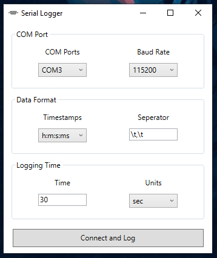

# Serial Logger

### Purpose
Logs serial data from available COM ports for specified time, and writes them into a .csv file.

### Requirements
* For building from source, .NET Framework 4.7.2

### Features
* Can automatically detect available COM ports
* Can log multiple values in single line, when seperated by commas
* Always places log file on Desktop for easy access

### To Do
* Implement timestamps
* Implement seperator
* Add automatic seperator detection for multiple values in a single line
* Maybe even a serial plotter as good as Arduino IDE's